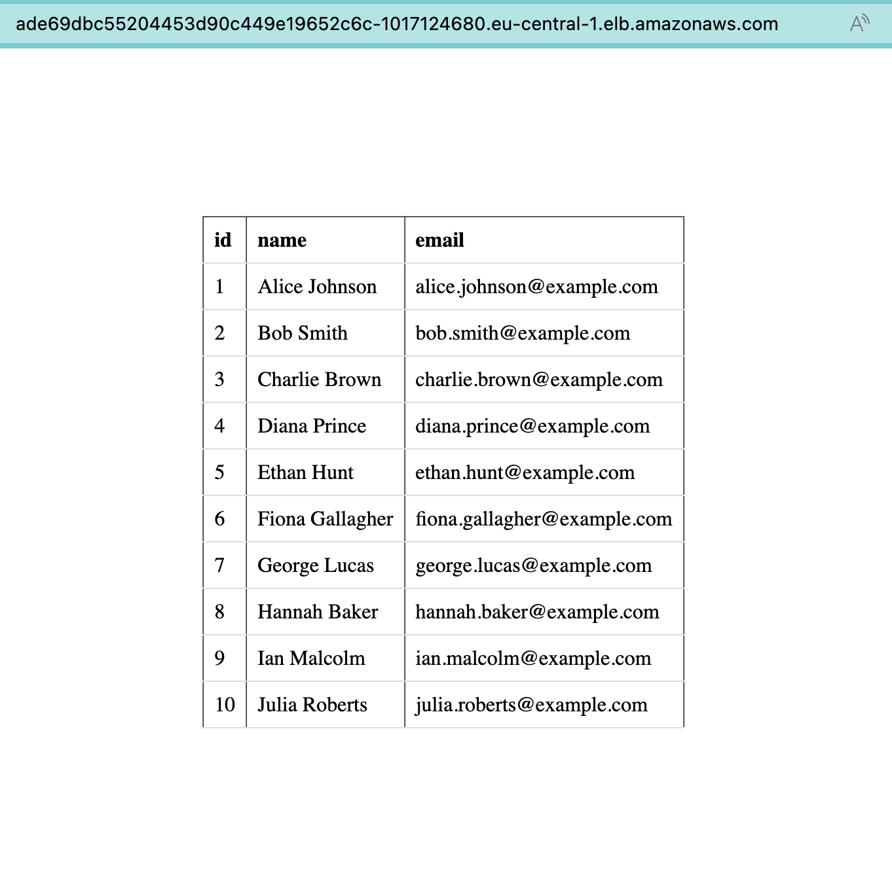
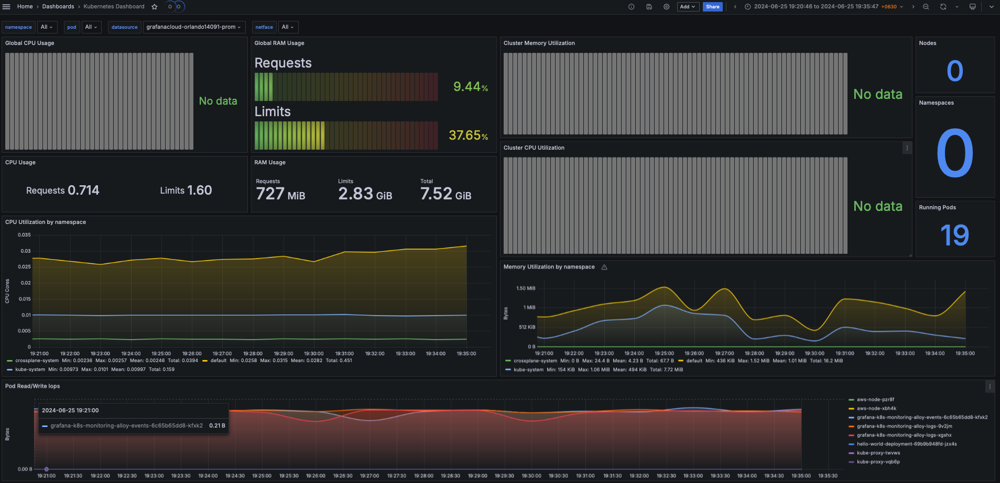

# Optimy Assessment

## Environment Setup

### 1 Prerequisites
- App deployment environment with Docker, Apache, and MySQL installed.
- Testing environment (Selenium/Python).
- AWS Account free tier configured.
- Grafana Cloud account access.

### 2 Env vars
Set the following environment variables in your environment:

```bash
export DB_HOST='THE_DB_HOST'
export DB_NAME='THE_DB_NAME'
export DB_USER='THE_DB_USER'
export DB_PASS='THE_DB_PASS'
```

### 3 Application
The application [(index.php)](./index.php) connecting to the Database:


### 4 Containerization
The the application can run within a container ([Dockerfile](./Dockerfile)) and will receive env vars such as MySQL connection parameters:
```bash
docker run -d -p 8080:80 \
    --name devops-app-container \
    -e DB_HOST=$DB_HOST \
    -e DB_NAME=$DB_NAME \
    -e DB_USER=$DB_USER \
    -e DB_PASS=$DB_PASS \
    devops-app:latest
```

### 5 AWS IaC with Cloudformation
The stack contain the following resources
- AWS RDS MySQL Database
- AWS ECR Repository
- AWS EKS Cluster
To deploy the infra, execute the following:
```bash
REGION="eu-central-1"
STACK_NAME="devops-app-stack"
TEMPLATE_FILE="cloudformation-template.yaml"

aws cloudformation create-stack \
    --region $REGION \
    --stack-name $STACK_NAME \
    --template-body file://$TEMPLATE_FILE \
    --parameters ParameterKey=SubnetIds,ParameterValue='["subnet-12345678","subnet-23456789"]' \
                 ParameterKey=CIDRBlocksAccess1,ParameterValue='18.185.149.80/32' \
                 ParameterKey=CIDRBlocksAccess2,ParameterValue='18.195.204.133/23' \
                 ParameterKey=CIDRBlocksAccess3,ParameterValue='3.125.120.187/32' \
                 ParameterKey=AllTrafficSourceSGId,ParameterValue='sg-0185a6c49fbf7ecf7'

aws cloudformation wait stack-create-complete --region $REGION --stack-name $STACK_NAME

aws cloudformation describe-stack-resources --region $REGION --stack-name $STACK_NAME
```

### 6 Functional testing case using a headless browser
The Assertions are made in the [test_webapp.py](./test_webapp.py) module using Selenium; to ensure
the correct page loads showing the content of the test table.
To run the tests:
```
pytest test_webapp.py
```
### 7 Observability with Grafana Cloud Dashboard
A Grafana dashboard had been created to display metrics such as CPU percentage and memory used.
The Grafana agent is configured in the EKS cluster, which is where the application runs.


